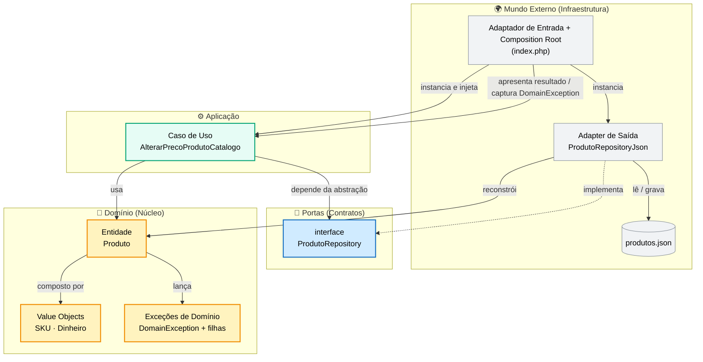
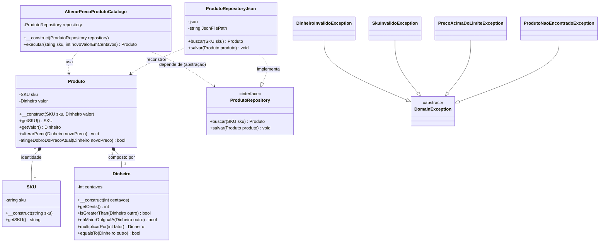
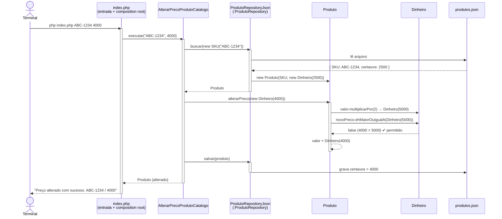
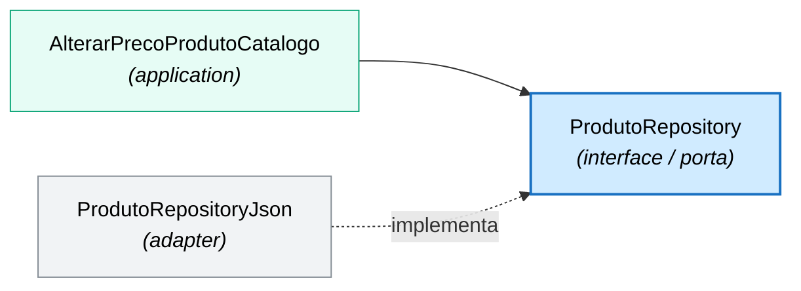
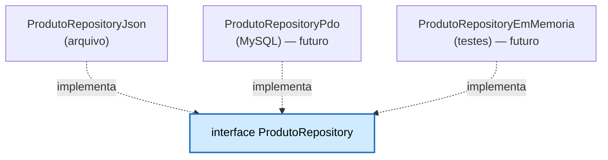

# 🏷️ Catálogo de Produtos — Estudo de Arquitetura Hexagonal

> Projeto de estudo em **PHP** que implementa um pequeno domínio de **catálogo de produtos** aplicando, de forma disciplinada, os princípios da **Arquitetura Hexagonal** (Ports & Adapters), **Domain-Driven Design** (Entidades, Value Objects e Exceções de Domínio) e **inversão de dependência**.

---

## 🎯 Objetivo do estudo

O propósito **não** é construir um ERP de catálogo completo, e sim **exercitar e tornar visíveis** os conceitos que sustentam um software bem desenhado:

| Conceito | O que se pratica aqui |
|----------|-----------------------|
| **Arquitetura Hexagonal** | Isolar o núcleo de negócio de detalhes de infraestrutura (arquivo JSON, banco, HTTP, CLI...). |
| **Ports & Adapters** | Definir um *contrato* (porta) e implementá-lo por fora (adapter), podendo trocar a tecnologia sem tocar no domínio. |
| **Entidade vs. Value Object** | Entender por que `Produto` tem identidade (`SKU`) e `Dinheiro` não — é definido pelo seu valor. |
| **Invariantes de domínio** | Regras que sempre valem (ex.: `Dinheiro` nunca é negativo) protegidas no próprio objeto. |
| **Regra de negócio na camada certa** | A regra do "dobro do preço" vive na **entidade** `Produto`, não no Value Object genérico. |
| **Encapsulamento do Value Object** | A entidade **compõe** operações do `Dinheiro` (`multiplicarPor`, `ehMaiorOuIgualA`) sem espiar o `int` interno. |
| **Exceções de domínio** | Cada regra violada sobe uma exceção **específica** (não `\Exception` genérica), sob uma base comum `DomainException`. |
| **Inversão de Dependência (DIP)** | O caso de uso depende de uma **abstração** (`ProdutoRepository`), não de uma implementação concreta. |
| **Separação de apresentação** | O núcleo **não imprime nada**: a saída e a tradução de erros vivem no adaptador de entrada (`index.php`). |
| **Composition Root** | Um único ponto (`index.php`) onde as dependências concretas são montadas e injetadas. |

A regra de negócio implementada é simples e proposital: **alterar o preço de um produto** do catálogo, respeitando o limite de que o novo preço **não pode ser maior ou igual ao dobro** do preço atual.

---

## 🧭 A metáfora do hexágono

Na Arquitetura Hexagonal, o **domínio** fica no centro, protegido. Ele só conhece **portas** (interfaces). Tudo que é "mundo externo" — bancos de dados, arquivos, APIs, UI, linha de comando — vive **fora**, conectando-se por **adapters** que implementam essas portas.

> 🔑 **Regra de ouro:** as setas de dependência sempre apontam **para dentro**, em direção ao domínio. O domínio nunca depende de detalhes.



---

## 🏗️ Estrutura do projeto

```
CATALOGO_DE_PRODUTOS/
├── index.php                       # 🟦 Composition Root + adaptador de entrada (CLI): monta, injeta e apresenta
├── produtos.json                   # 💾 "Banco de dados" (fixture) usado pelo adapter
├── composer.json                   # ⚙️ Autoload PSR-4
└── src/
    ├── domain/                     # 💛 Núcleo: regras de negócio puras
    │   ├── Produto.php             #    Entidade (tem identidade: SKU)
    │   ├── VO/
    │   │   ├── SKU.php             #    Value Object — identificador no formato ABC-1234
    │   │   └── Dinheiro.php        #    Value Object — definido pelo valor (centavos)
    │   └── exception/              #    Exceções de domínio (uma por regra)
    │       ├── DomainException.php             # base abstrata
    │       ├── DinheiroInvalidoException.php
    │       ├── SkuInvalidoException.php
    │       ├── PrecoAcimaDoLimiteException.php
    │       └── ProdutoNaoEncontradoException.php
    ├── port/                       # 🔌 Contratos que o domínio expõe
    │   └── ProdutoRepository.php
    ├── application/                # ⚙️ Orquestração da regra de negócio
    │   └── AlterarPrecoProdutoCatalogo.php
    └── Adapter/                    # 🌍 Implementações concretas (infra)
        └── ProdutoRepositoryJson.php
```

### Mapeamento de namespaces (PSR-4)

`composer.json` mapeia um único prefixo para `src/`:

| Namespace | Pasta |
|-----------|-------|
| `Rodrigotavares\Catalogo\` | `src/` |

Os subnamespaces seguem as pastas: `…\domain`, `…\domain\VO`, `…\domain\exception`, `…\port`, `…\application`, `…\Adapter`.

---

## 🧱 Modelo de domínio



### 💛 Entidade `Produto`
Tem **identidade própria** (`SKU`): dois produtos com o mesmo preço continuam sendo produtos diferentes. É **mutável** no sentido de que seu preço evolui (`alterarPreco`) — mas a **regra** de alteração mora aqui, na entidade, e o **cálculo** é delegado ao Value Object.

### 🔖 Value Object `SKU`
Identificador de produto que **valida o próprio formato** no construtor: `^[A-Z]{3}-\d{4}$` (3 letras maiúsculas + hífen + 4 dígitos, ex.: `ABC-1234`). Um `SKU` inválido nunca chega a existir — ele falha na construção com `SkuInvalidoException`.

### 💎 Value Object `Dinheiro`
- **Não tem identidade** — é definido **pelo valor** (`centavos`). `Dinheiro(2500)` é intercambiável com qualquer outro `Dinheiro(2500)`.
- **Genérico e reutilizável**: expõe operações monetárias puras (`multiplicarPor`, `ehMaiorOuIgualA`, `isGreaterThan`, `equalsTo`) e **não carrega regra de negócio do catálogo**.
- **Protege seu invariante estrutural**: não existe `Dinheiro` negativo — o construtor rejeita valores menores que zero com `DinheiroInvalidoException`. Zero (`R$ 0,00`) é um valor válido.

> 💡 Trabalhar em **centavos (int)** evita os erros clássicos de ponto flutuante com dinheiro (`0.1 + 0.2 != 0.3`).

### 🧨 Exceções de domínio
Toda violação de regra de negócio sobe uma exceção **específica**, todas herdando da base abstrata `DomainException`. Isso separa erro de negócio de erro de infraestrutura e permite capturá-los por tipo:

| Exceção | Quando ocorre |
|---------|---------------|
| `DinheiroInvalidoException` | `Dinheiro` construído com valor negativo. |
| `SkuInvalidoException` | `SKU` fora do formato `ABC-1234`. |
| `PrecoAcimaDoLimiteException` | Novo preço **maior ou igual ao dobro** do preço atual. |
| `ProdutoNaoEncontradoException` | `SKU` inexistente no catálogo. |

> Erros de **infraestrutura** (ex.: arquivo `produtos.json` vazio/inexistente) seguem como `\Exception` genérica — por **não** serem regra de domínio.

---

## 📐 A regra do "dobro do preço" (e por que ela mora onde mora)

A regra: **o novo preço não pode ser maior ou igual ao dobro do preço atual.**

```php
// src/domain/Produto.php
private function atingeDobroDoPrecoAtual(Dinheiro $novoPreco): bool
{
    $dobroDoPrecoAtual = $this->valor->multiplicarPor(2);

    return $novoPreco->ehMaiorOuIgualA($dobroDoPrecoAtual);
}

public function alterarPreco(Dinheiro $novoPreco): void
{
    if ($this->atingeDobroDoPrecoAtual($novoPreco)):
        throw new PrecoAcimaDoLimiteException("O Novo Preço não pode ser Maior ou Igual ao Dobro do Preço Original");
    endif;

    $this->valor = $novoPreco; // ALTERAÇÃO DE ESTADO
}
```

**Duas decisões de design importantes:**

1. **Camada certa.** A regra é uma **invariante do `Produto`** — logo, vive na **entidade**, não no Value Object `Dinheiro` (que é genérico e não deveria conhecer regras do catálogo).
2. **Sem furar o encapsulamento.** A entidade **não** abre o VO (`getCents() * 2`). Ela **compõe** as operações que o próprio `Dinheiro` oferece: `multiplicarPor(2)` devolve um novo `Dinheiro`, e `ehMaiorOuIgualA(...)` compara dois `Dinheiro`. O `int` interno nunca vaza para fora do VO.

---

## 🔄 Fluxo de uma alteração de preço

O diagrama abaixo mostra o caminho completo de `php index.php ABC-1234 4000` — alterar o preço do produto `ABC-1234` para 4000 centavos (R$ 40,00).



**Repare na divisão de responsabilidades:**
- A **entidade** decide *sob quais regras* o preço pode mudar (`alterarPreco`).
- O **Value Object** sabe *como* os valores se combinam (`multiplicarPor`, `ehMaiorOuIgualA`) e garante o invariante.
- O **caso de uso** apenas **orquestra**: busca → altera → salva → **retorna** o produto (não imprime nada).
- O **adapter de saída** é o único que conhece o detalhe "isto é um arquivo JSON".
- O **adaptador de entrada** (`index.php`) cuida da **apresentação**: imprime o resultado e traduz `DomainException` em mensagem amigável.

---

## ⬇️ Direção das dependências (o coração da arquitetura)

O caso de uso depende de uma **interface**, e a implementação concreta é "plugada" por baixo. Isso é a **Inversão de Dependência**: o detalhe (JSON) depende do contrato, e não o contrário.



**Consequência prática:** trocar o JSON por um banco de dados (ex.: `ProdutoRepositoryPdo`) **não exige nenhuma alteração** no domínio nem no caso de uso. Basta criar um novo adapter que implemente `ProdutoRepository` e injetá-lo no Composition Root.



---

## 🚀 Como executar

> Pré-requisitos: **PHP 8.1+** (uso de *constructor property promotion*) e **Composer**.

```bash
# 1. Gerar o autoload PSR-4
composer dump-autoload

# 2. Alterar o preço de um produto: php index.php <SKU> <novoValorEmCentavos>
php index.php ABC-1234 4000
```

O `index.php` recebe **dois argumentos** de linha de comando: o **SKU** do produto e o **novo valor em centavos**. Sem os dois, exibe o modo de uso e encerra com código `1`.

### Saída esperada (sucesso)

```
Preço alterado com sucesso.
  SKU:                   ABC-1234
  Novo valor (centavos): 4000
```

Após a execução, abra o [`produtos.json`](produtos.json): o `centavos` do produto usado terá sido atualizado e persistido.

### Saída esperada (regra de negócio violada)

```bash
php index.php XYZ-5678 9999      # preço atual 4500; 9999 ≥ dobro (9000)
```
```
Erro: O Novo Preço não pode ser Maior ou Igual ao Dobro do Preço Original
```
> Sai com código `1`. A mensagem vem da `PrecoAcimaDoLimiteException`, capturada como `DomainException` no `index.php`.

### Fixture de exemplo — [`produtos.json`](produtos.json)

```json
[
    { "SKU": "ABC-1234", "centavos": 2500 },
    { "SKU": "XYZ-5678", "centavos": 4500 },
    { "SKU": "DEF-0001", "centavos": 100000 }
]
```

---

## 🛣️ Próximos passos (evolução do estudo)

- [ ] **Regra de "preço não pode ser zero"** — se aplicável, modelá-la na entidade `Produto` (e não no VO genérico `Dinheiro`, que aceita zero de propósito).
- [ ] **Novos adapters** — `ProdutoRepositoryPdo` (banco) e `ProdutoRepositoryEmMemoria` (testes), provando a troca de infraestrutura sem tocar no núcleo.
- [ ] **Testes automatizados** — testar entidade, Value Objects e caso de uso com um repositório em memória (sem I/O).
- [ ] **Porta de entrada HTTP** — expor a operação via HTTP além da CLI, mostrando múltiplos *driving adapters* sobre o mesmo caso de uso.
- [ ] **Listagem do catálogo** — uma operação de consulta dedicada (em vez do antigo `var_dump`), também apresentada pelo adaptador de entrada.

---

## 📚 Conceitos de referência

- **Hexagonal Architecture (Ports & Adapters)** — Alistair Cockburn
- **Domain-Driven Design** — Eric Evans (Entidades, Value Objects, Repositórios)
- **Clean Architecture / Dependency Inversion Principle** — Robert C. Martin

---

> 📝 Projeto de estudo. O foco é a **clareza arquitetural**, não a completude funcional.
